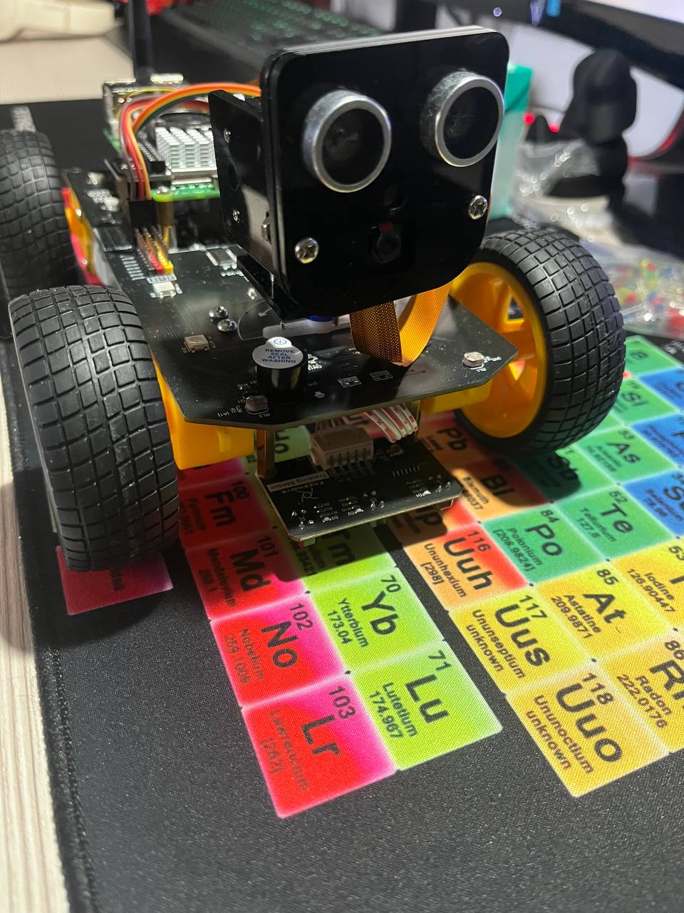

# self_navigation

Born from an idea of testing how much an ML model could learn about moving autonomously only with an HC-SR04 distance sensor. This repository contains a **self-navigation** robot project that uses hardware and movement code from [Freenove’s 4WD Smart Car Kit for Raspberry Pi](https://github.com/Freenove/Freenove_4WD_Smart_Car_Kit_for_Raspberry_Pi/). The code has been **significantly modified** to fit these project purposes, to optimise the workflow and expanded to support a **deep learning** classification approach for obstacle avoidance, plus other enhancements.

## Premises

Since i am an independent individual, i invested my own money to buy this robot kit from Freenove. I wanted to test how much could a robot equipped with only a distance sensor could learn from its whereabouts and take the right decisions regarding where and how to turn to avoid a certain obstacle. I am aware that a **Reinforcement Learning** approach rather than a **Supervised Learning**'s would have been more appropriate, but the Raspberry Pi 5 did not have enough computational power to support this approach, especially when working under 3.7V. The Freenove basecode had to undergo some revising and rewriting in order to adapt an automised way of acquiring data on its own. 

## Folder Structure

```
self_navigation/
├─ data/
├─ data_processing/
│   ├─ clean_data.py
│   ├─ columns.py
│   ├─ new_feature.py
│   └─ data_processing/
├─ models/
├─ modules/
│   ├─ datasetClass.py   # Custom PyTorch Dataset
│   ├─ modelClass.py     # MLP or classification model classes
│   └─ training_tools.py # Scripts to train/evaluate the model
├─ Server/
├─ .gitignore
├─ .gitattributes
└─ README.md
```

### Key Components

- **`data/`**: 
  Contains the datasets.

- **`data_processing/`**: Scripts for data preprocessing, feature engineering, and dataset cleaning.  
- **`models/`**: Where final trained models and labels are stored.  
- **`modules/`**:  
  - **`datasetClass.py`**: Custom PyTorch Dataset definitions for training.  
  - **`modelClass.py`**: The neural network architectures for classification.  
  - **`training_tools.py`**: Utility scripts (early stopping, metrics, etc.)  
- **`Server/`**:  Contains the **robot logic** and the **Freenove**-derived code. It even includes the inference code to start the ML-based navigation. 
  - **`test_inference.py`**: The script you actually run to do inference on the Pi, scanning distances and deciding motor commands via the model.   

## How It Works

1. **Data Collection & Training**  
   - We gather sensor readings (distances from ultrasonic sensors) plus motor actions, then store them in CSV (see `data/`).  
   - We train a classification model in `modules/` to predict directional actions from (L, M, R) distances.  

2. **Inference on the Pi**  
   - We run `test_inference.py` on the Raspberry Pi.  
   - It loads the **`best_model.pth`** from `MODEL_PATH`, plus the **`classes.json`** array.  
   - Reads sensor data (L, M, R) by servo sweeping. 
   - Calls the model for a predicted direction.  
   - Each direction(or class) relates to precise motor values. A regression task was before attempted but there always was a small offset between the predicted motor
     value and the precise value that it should have predicted, making the robot, practically imprecise and unreliable. The best pactical solution was to make it predict
     the direction to take and "hardcode" the motor values. 

3. **Freenove Integration**  
   - The code in the `Server/` folder is adapted from Freenove’s official 4WD Smart Car Kit. We’ve added improvements and reorganized some logic, but it retains the core structure for controlling the hardware on the Pi.

## Tweaks & Flaws

To better help the model's predictions a "memory" system was implemented. Initially it stored up to 4 previous inputs; this caused the robot to bump into the obstacle before
actually avoiding it. Reducing its memory helped to a better inference timing and the robot does not bump anymore now. Despite these changes, the timing of the swerving and the speed of the wheels could cause sometimes the robot to bump into an obstacle before avoiding it. The solution would be to further reduce the forward speed of the motors, but due to the board working with 3.7V, there is not enough torque to counter the grip opposed by the floor, hence it is impossible to further reduce it. 

## License & Attribution

- The **original code** in `Server/` is from [Freenove’s 4WD Smart Car Kit for Raspberry Pi](https://github.com/Freenove/Freenove_4WD_Smart_Car_Kit_for_Raspberry_Pi/). 
- That code is licensed under the **Creative Commons Attribution-NonCommercial-ShareAlike 3.0 Unported** (CC BY-NC-SA 3.0) license.  
- We have **modified** and added to it extensively here, but we continue to **respect** and **retain** the same **noncommercial, share-alike** licensing conditions.  
- **Credit**: Freenove for the original codebase. We are not affiliated with or endorsed by Freenove in an official capacity.

### Important Notes on Licensing

1. **NonCommercial**: This project cannot be used for commercial advantage or monetary compensation.  
2. **ShareAlike**: Any re-distribution or derivative works must maintain the same CC BY-NC-SA 3.0 license (or a compatible one).  
3. **Attribution**: Please ensure you credit the original Freenove repository and mention your modifications clearly.  

## Contact & Disclaimer

- **Disclaimer**: Use of the robot is at your own risk; we disclaim liability for any damage or injuries resulting from modifications or usage. 
- For general questions, create a GitHub issue in this repository.

## Gallery

</img>
<video src="imgs/video.mp4" controls></video>